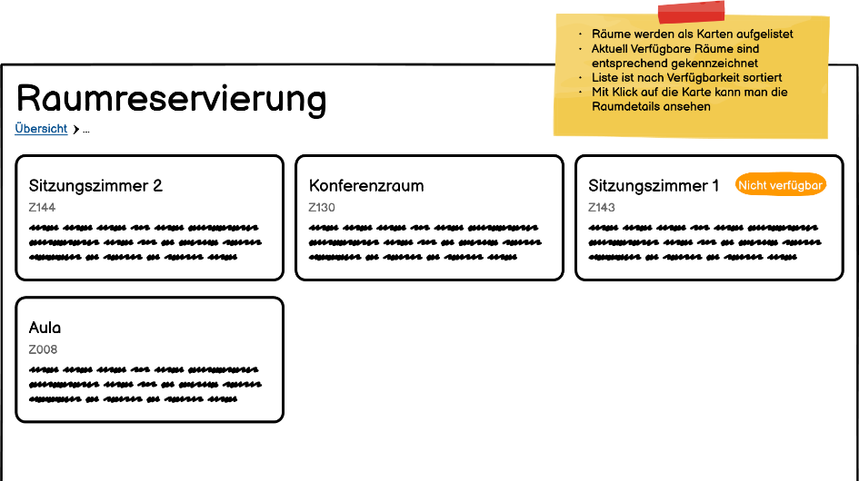
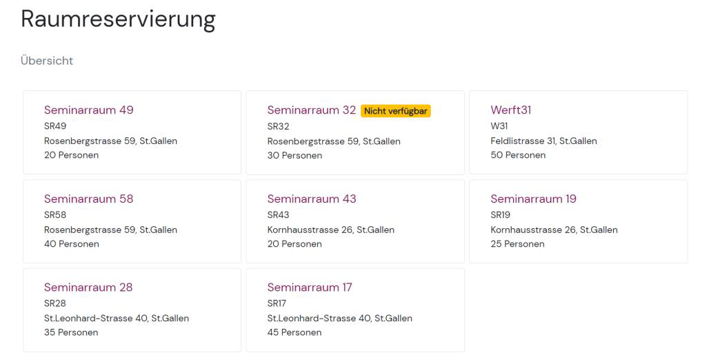
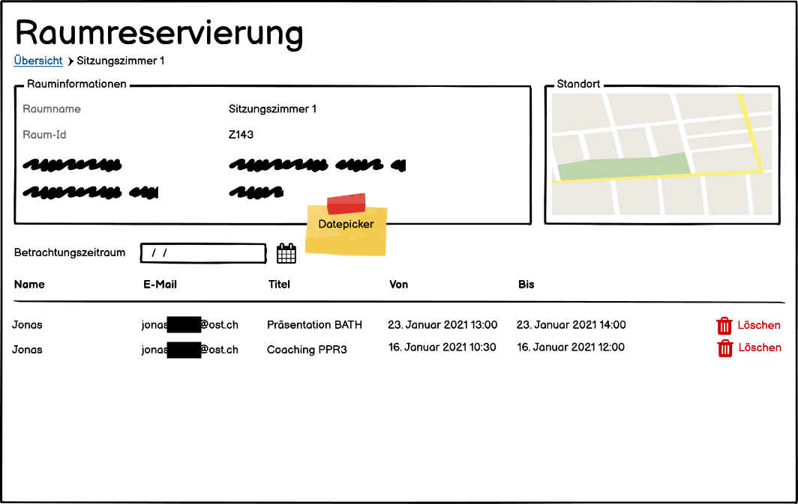
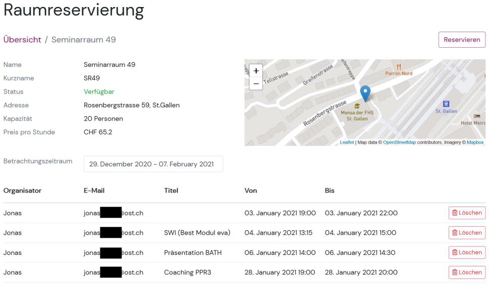
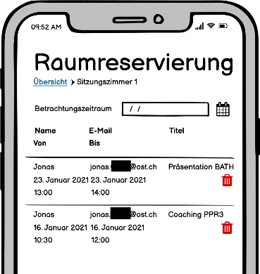
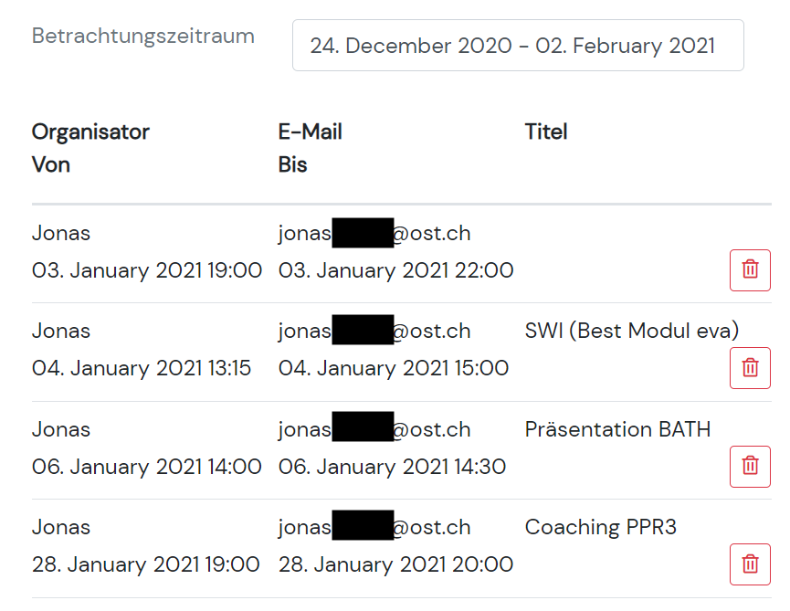
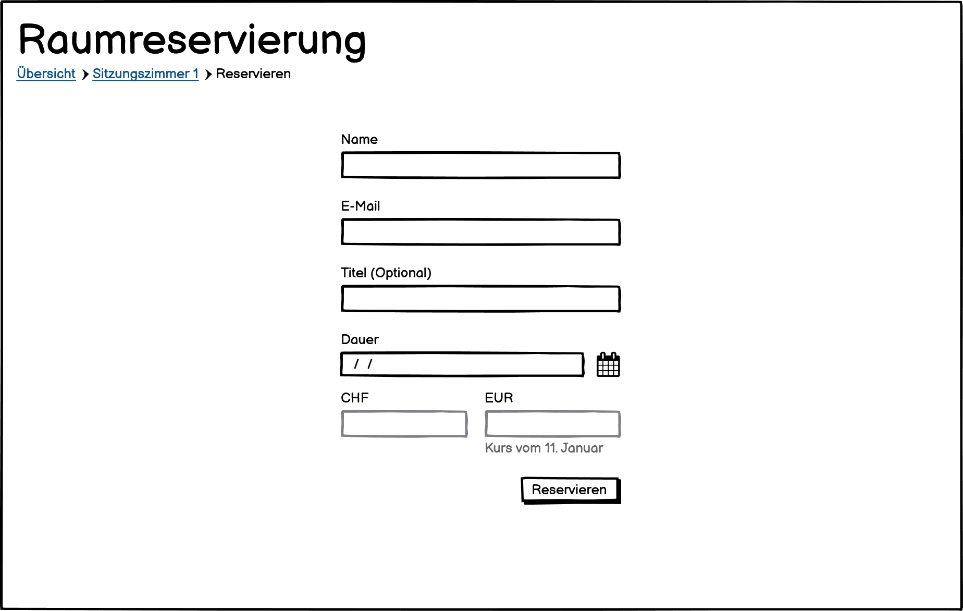
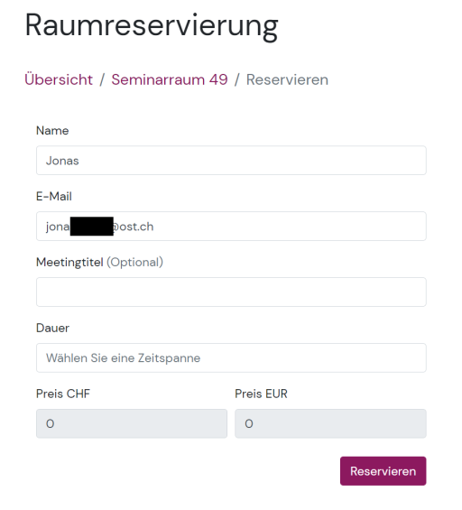

# Raumreservierungssystem (SWI1)

Vanilla-JavaScript-Frontend für ein Raumreservierungstool an der Ostschweizer Fachhochschule (OST): keine Frameworks, nur DOM und `fetch`, Bootstrap 4 für Layout und Komponenten. Daten kommen von einer bereitgestellten REST-API.

## Applikation

Vor der Implementierung wurden Mockups erstellt; unten jeweils Plan und umgesetzte Ansicht.

### Hauptmenü (Raumübersicht)

Oben Programmtitel und Breadcrumb als einziges Navigationselement zwischen den Seiten. Räume werden als Karten geladen (REST), mit Hover-Animation; nicht verfügbare Räume tragen ein Badge. Klick auf eine Karte öffnet die Raumdetailseite.

**Mockup**

**Umsetzung**

### Raumdetail (Informationen, Karte, Buchungen)

Rauminformationen, Leaflet-Karte (OpenStreetMap), Buchungsliste mit Datepicker (Zeitraum Von/Bis in einem Dialog) und Button «Reservieren». Auf schmalen Viewports werden Buchungen als Liste mit zweiter Zeile dargestellt; der Löschen-Button zeigt dort nur noch das Icon.

**Mockup**

**Umsetzung**

**Mobile — Buchungsübersicht**

Mockup:

Screenshot:

### Reservierung (Formular)

Eigenständige Seite (kein Dialog): Name und E-Mail werden im LocalStorage vorgehalten, Zeitraum wieder über den Datepicker. Fehler erscheinen am Feld oder als Bootstrap-Alert; nach Erfolg Rückkehr zur Raumübersicht mit Bestätigung.

**Mockup**

**Umsetzung**

## Entwicklung (Kurzfassung)

- **Kein Router** (Vorgabe: lokal lauffähig) — der PageHandler übernimmt die «Routing»-Logik und baut den sichtbaren Inhalt dynamisch in JavaScript (kein verstecktes HTML im DOM).
- **Dateien:** `pagehandler.js` (Seitenwechsel, ErrorHandler, ListenerStorage), `restclient.js` (API), `componentfactory.js` / `componentbuilders.js` (UI, Builder-Pattern), `bookingform.js` (Formular), `constants.js`, `util.js` (Karte, Datepicker, Moment.js).
- **ListenerStorage:** Event-Listener werden erst nach dem Aufbau des DOM gesetzt (Workaround für dynamisch erzeugte Elemente).
- **Stärken:** schlichtes UI, responsiv, intuitiver Ablauf.
- **Schwächen:** keine Suche «freie Räume im Zeitraum», kein Wechsel Raum↔Raum ohne Hauptmenü; wartbare Architektur durch manuelles DOM limitiert; XSS-Risiko bei lokaler Demo akzeptiert.
